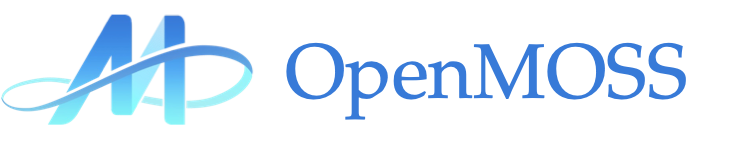

<div align="center">
    <h1>
    MOSS: Text to Spoken Dialogue Generation
    </h1>
    <p>
    
    <p>
    </p>
    <a href="https://blog.example.com"></a>
    <a href="#"></a>
    <a href="https://huggingface.co/fnlp/MOSS-TTSD-v0"></a>
    <a href="https://github.com/"></a>
    <a href="https://github.com/OpenMOSS/MOSS-TTSD"></a>
    <a href="https://github.com/OpenMOSS/MOSS-TTSD"></a>
</div>


# MOSS-TTSD 🪐

## Overview

MOSS-TTSD (text to spoken dialogue) is an open-source bilingual spoken dialogue synthesis model that supports both Chinese and English.
It can transform dialogue scripts between two speakers into natural, expressive conversational speech.
MOSS-TTSD supports voice cloning and single-session speech generation of up to 960 seconds, making it ideal for AI podcast production.

## Highlights

- **Highly Expressive Dialogue Speech**: Built on unified semantic-acoustic neural audio codec, a pre-trained large language model, millions of hours of TTS data, and 400k hours synthetic and real conversational speech, MOSS-TTSD generates highly expressive, human-like dialogue speech with natural conversational prosody.
- **Two-Speaker Voice Cloning**: MOSS-TTSD supports zero-shot two speakers voice cloning and can generate conversational speech with accurate speaker swithcing based on dialogue scripts.
- **Chinese-English Bilingual Support**: MOSS-TTSD enables highly expressive speech generation in both Chinese and English.
- **Long-Form Speech Generation (up to 960 seconds)**: Thanks to low-bitrate codec and training framework optimization, MOSS-TTSD has been trained for long speech generation, enabling single-session speech generation of up to 960 seconds.
- **Fully Open Source & Commercial-Ready**: MOSS-TTSD and its future updates will be fully open-source and support free commercial use.


## News 🚀

- **[2025-06-20]** MOSS-TTSD v0 is released!

## Installation

## Usage

### Local Inference

**GPU Requirements**

### Web UI Usage

### API Usage

Powered by siliconflow. Stay tuned!

### Podcast Generation

We provide a podcast generation tool that directly analyzes either a URL or a user-uploaded PDF file, extracting content to generate a high-quality podcast segment.

## Demos

## License

MOSS-TTSD is released under the Apache 2.0 license.

## Citation

```
@article{moss2025ttsd,
  title={Text to Spoken Dialogue Generation}, 
  author={OpenMOSS Team},
  year={2025}
}
```


## ⚠️ Usage Disclaimer

This project provides an open-source spoken dialogue synthesis model intended for academic research, educational purposes, and legitimate applications such as AI podcast production, assistive technologies, and linguistic research. Users must not use this model for unauthorized voice cloning, impersonation, fraud, scams, deepfakes, or any illegal activities, and should ensure compliance with local laws and regulations while upholding ethical standards. The developers assume no liability for any misuse of this model and advocate for responsible AI development and use, encouraging the community to uphold safety and ethical principles in AI research and applications. If you have any concerns regarding ethics or misuse, please contact us.